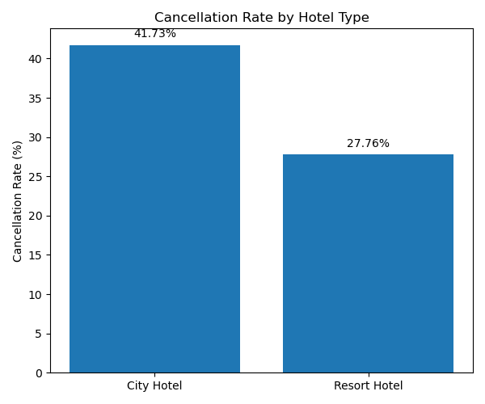

# Hotel Booking Analysis

## Project Overview

This project analyzes hotel booking data using PostgreSQL and statistical analysis techniques.

The dataset contains booking information from both City Hotels and Resort Hotels. The goal of this project is to identify booking patterns, investigate reservation cancellation behavior, detect anomalies, and uncover factors associated with higher cancellation rates.

---

## Objectives

- Explore the structure and quality of the dataset.
- Analyze booking patterns across hotel types, countries, and customer segments.
- Investigate reservation cancellation behavior.
- Identify factors associated with higher cancellation rates.
- Test hypotheses related to booking cancellations.
- Provide data-driven insights and recommendations.

---

## Dataset

The dataset contains:

- 119,390 hotel bookings
- 32 variables
- Reservations from both City Hotels and Resort Hotels

---

## Tools Used

- SQL
- Statistical Analysis

---

# Data Understanding

## Dataset Overview

The dataset consists of 119,390 hotel reservations and 32 variables describing customer characteristics, booking details, hotel information, and reservation outcomes.

<details>
<summary>View SQL Query</summary>

```sql
SELECT COUNT(*) AS total_bookings
FROM hotel_bookings;
```

</details>

---


## Missing Values Investigation

Missing values were identified in four variables.

| Variable | Missing Values |
|----------|---------------:|
| company | 112593 |
| agent | 16340 |
| country | 488 |
| children | 4 |

The `company` variable contains missing values in more than 94% of all observations and was excluded from further analysis.

The `agent` variable also contains a substantial number of missing values. Missing values in `country` and `children` represent only a small fraction of the dataset and are unlikely to significantly affect the analysis.

<details>
<summary>View SQL Query</summary>

```sql
SELECT
    COUNT(*) FILTER (WHERE company IS NULL) AS missing_company,
    COUNT(*) FILTER (WHERE agent IS NULL) AS missing_agent,
    COUNT(*) FILTER (WHERE country IS NULL) AS missing_country,
    COUNT(*) FILTER (WHERE children IS NULL) AS missing_children
FROM hotel_bookings;
```

</details>

---


## ADR Outlier Detection

ADR (Average Daily Rate) was analyzed to identify extreme values.

Key findings:

- Average ADR = 101.83
- 99th percentile ADR = 252
- Maximum ADR = 5400

The maximum ADR value is substantially larger than the typical booking rates observed in the dataset and was flagged as a potential outlier.

<details>
<summary>View SQL Queries</summary>

```sql
SELECT
    AVG(adr) AS avg_adr,
    MAX(adr) AS max_adr
FROM hotel_bookings;

SELECT
    PERCENTILE_CONT(0.99)
    WITHIN GROUP (ORDER BY adr)
FROM hotel_bookings;
```

</details>

# Exploratory Data Analysis

## Hotel Distribution

The dataset contains reservations from two hotel types.

| Hotel | Bookings |
|---------|---------:|
| City Hotel | 79,330 |
| Resort Hotel | 40,060 |

City Hotels account for approximately two-thirds of all reservations in the dataset.

<details>
<summary>View SQL Query</summary>

```sql
SELECT
    hotel,
    COUNT(*) AS bookings
FROM hotel_bookings
GROUP BY hotel
ORDER BY bookings DESC;
```

</details>

---

## Overall Cancellation Rate

A total of 44,224 reservations were cancelled.

| Metric | Value |
|---------|---------:|
| Total Bookings | 119,390 |
| Cancelled Bookings | 44,224 |
| Cancellation Rate | 37.04% |

More than one-third of all reservations were cancelled.

<details>
<summary>View SQL Query</summary>

```sql
SELECT
    COUNT(*) AS bookings,
    SUM(is_canceled) AS cancellations,
    ROUND(100.0 * AVG(is_canceled),2) AS cancellation_rate
FROM hotel_bookings;
```

</details>

---


## Deposit Type Distribution

Most reservations were made without a deposit.

| Deposit Type | Bookings |
|---------|---------:|
| No Deposit | 104,641 |
| Non Refund | 14,587 |
| Refundable | 162 |

---

## Repeat Guest Distribution

Only a small proportion of customers are repeat guests.

| Repeat Guest | Bookings |
|---------|---------:|
| No | 115,580 |
| Yes | 3,810 |

Repeat guests account for approximately 3.2% of all reservations.

---

## Lead Time Overview

| Metric | Days |
|---------|---------:|
| Minimum | 0 |
| Average | 104.01 |
| 95th Percentile | 320 |
| Maximum | 737 |

Reservations were typically made approximately 104 days before arrival.

While the maximum lead time reached 737 days, 95% of all reservations were made within 320 days of arrival. This indicates that extremely early bookings were rare and should be treated as outliers rather than representative customer behavior.

<details>
<summary>View SQL Queries</summary>

```sql
SELECT
    MIN(lead_time),
    ROUND(AVG(lead_time),2),
    MAX(lead_time)
FROM hotel_bookings;

SELECT
    PERCENTILE_CONT(0.95)
    WITHIN GROUP (ORDER BY lead_time)
FROM hotel_bookings;
```

</details>

## Length of Stay Overview

| Metric | Nights |
|---------|---------:|
| Minimum | 0 |
| Average | 3.43 |
| 99th Percentile | 14 |
| Maximum | 69 |

While the longest recorded stay lasted 69 nights, 99% of all reservations were 14 nights or shorter. This indicates that extremely long stays are rare outliers and do not represent typical customer behavior.

<details>
<summary>View SQL Queries</summary>

```sql
SELECT
    MIN(stays_in_week_nights + stays_in_weekend_nights) AS min_nights,
    ROUND(
        AVG(stays_in_week_nights + stays_in_weekend_nights),
        2
    ) AS avg_nights,
    MAX(stays_in_week_nights + stays_in_weekend_nights) AS max_nights
FROM hotel_bookings;

SELECT
    PERCENTILE_CONT(0.99)
    WITHIN GROUP (
        ORDER BY stays_in_week_nights + stays_in_weekend_nights
    ) AS stay_99th_percentile
FROM hotel_bookings;
```

</details>

# Hypothesis Testing

## H1: City Hotel reservations are cancelled more frequently than Resort Hotel reservations

### Hypotheses

H₀: Cancellation rates are equal for both hotel types.

H₁: City Hotel reservations have a higher cancellation rate.

### Results

| Hotel | Bookings | Cancellations | Cancellation Rate |
|---------|---------:|---------:|---------:|
| City Hotel | 79,330 | 33,102 | 41.73% |
| Resort Hotel | 40,060 | 11,122 | 27.76% |

<p align="center">
  
</p>

### Conditional Probability Interpretation

P(Cancelled | City Hotel) = 0.4173

P(Cancelled | Resort Hotel) = 0.2776

The probability of cancellation is approximately 14 percentage points higher for City Hotels than for Resort Hotels.

### Conclusion

The results support alternative hypothesis (H₁). Reservations made at City Hotels are considerably more likely, approximately 14 percentage to be cancelled than reservations made at Resort Hotels.

## H2: Longer lead times increase the probability of cancellation

### Hypotheses

**H₀:** The average lead time is the same for cancelled and non-cancelled reservations.

**H₁:** Cancelled reservations have a higher average lead time than non-cancelled reservations.

---

### Average Lead Time by Reservation Status

| Reservation Status | Bookings | Average Lead Time | Standard Deviation |
|----------|----------:|----------:|----------:|
| Not Cancelled | 75,166 | 79.98 | 91.11 |
| Cancelled | 44,224 | 144.85 | 118.62 |

<details>
<summary>View SQL Queries</summary>

```sql
SELECT
    is_canceled,
    COUNT(*) AS bookings,
    ROUND(AVG(lead_time),2) AS avg_lead_time,
    ROUND(STDDEV(lead_time),2) AS std_lead_time
FROM hotel_bookings
GROUP BY is_canceled;
```

</details>

Cancelled reservations were booked on average **64 days earlier** than reservations that were eventually completed.

---

### Cancellation Rate by Lead Time Group

| Lead Time Group | Bookings | Cancellation Rate |
|----------|----------:|----------:|
| 0–30 days | 38,706 | 18.56% |
| 31–90 days | 29,553 | 37.70% |
| 91–180 days | 26,439 | 44.71% |
| 180+ days | 24,692 | 57.01% |

<details>
<summary>View SQL Queries</summary>

```sql
SELECT
    CASE
        WHEN lead_time <= 30 THEN '0-30 days'
        WHEN lead_time <= 90 THEN '31-90 days'
        WHEN lead_time <= 180 THEN '91-180 days'
        ELSE '180+ days'
    END AS lead_time_group,
    COUNT(*) AS bookings,
    ROUND(100.0 * AVG(is_canceled),2) AS cancellation_rate
FROM hotel_bookings
GROUP BY lead_time_group
ORDER BY lead_time_group;

```

</details>

A clear positive relationship can be observed between lead time and cancellation rate. Reservations made more than 180 days before arrival were cancelled over three times more frequently than reservations made within 30 days of arrival.

---

### Interpretation

The results suggest that customers who book far in advance are significantly more likely to cancel their reservations. One possible explanation is that plans are more likely to change when the booking is made many months before the arrival date.

The large sample sizes provide strong evidence that the observed difference is not due to random variation.

---

### Conclusion

The results strongly support **H₁**. Longer lead times are associated with substantially higher cancellation rates and appear to be an important predictor of reservation cancellations.

<details>
<summary>View SQL Queries</summary>

```sql
SELECT
    CASE
        WHEN lead_time <= 30 THEN '0-30 days'
        WHEN lead_time <= 90 THEN '31-90 days'
        WHEN lead_time <= 180 THEN '91-180 days'
        ELSE '180+ days'
    END AS lead_time_group,
    COUNT(*) AS bookings,
    ROUND(100.0 * AVG(is_canceled),2) AS cancellation_rate
FROM hotel_bookings
GROUP BY lead_time_group
ORDER BY lead_time_group;

SELECT
    is_canceled,
    COUNT(*) AS bookings,
    ROUND(AVG(lead_time),2) AS avg_lead_time,
    ROUND(STDDEV(lead_time),2) AS std_lead_time
FROM hotel_bookings
GROUP BY is_canceled;
```

</details>

## H3: Repeated guests are less likely to cancel reservations

### Hypotheses

**H₀:** Repeated guests are equally or more likely to cancel reservations than non-repeated guests.

**H₁:** Repeated guests are less likely to cancel reservations than non-repeated guests.

---

### Results

| Repeated Guest | Bookings | Cancellation Rate |
|----------|----------:|----------:|
| No | 115,580 | 37.79% |
| Yes | 3,810 | 14.49% |

<details>
<summary>View SQL Query</summary>

```sql
SELECT
    is_repeated_guest,
    ROUND(100.0 * AVG(is_canceled),2) AS cancellation_rate,
    COUNT(*) AS bookings
FROM hotel_bookings
GROUP BY is_repeated_guest;
```

</details>
The cancellation rate among repeated guests was substantially lower than among first-time guests.

---

### Conditional Probability Interpretation

P(Cancelled | New Guest) = 0.3779

P(Cancelled | Repeated Guest) = 0.1449

Repeated guests were approximately 2.6 times less likely to cancel their reservations.

---

### Interpretation

Customers who have previously stayed at the hotel appear to be  more committed to their reservations. Familiarity with the hotel and previous positive experiences may reduce the likelihood of cancellation.

---

### Conclusion

The results strongly support **H₁**. Repeated guests exhibit substantially lower cancellation rates than first-time guests, suggesting that customer loyalty is associated with more reliable booking behavior.

## H4: Previous cancellations increase the likelihood of future cancellations

### Hypotheses

**H₀:** Guests with previous cancellations are equally or less likely to cancel future reservations.

**H₁:** Guests with previous cancellations are more likely to cancel future reservations.

---

### Results

| Category | Bookings | Cancellation Rate |
|----------|----------:|----------:|
| No previous cancellations | 112,906 | 33.91% |
| At least one previous cancellation | 6,484 | 91.64% |


<details>
<summary>View SQL Query</summary>

```sql
SELECT
    CASE
        WHEN previous_cancellations = 0
        THEN 'No previous cancellations'
        ELSE 'At least one previous cancellation'
    END AS category,
    COUNT(*) AS bookings,
    ROUND(100.0 * AVG(is_canceled),2) AS cancellation_rate
FROM hotel_bookings
GROUP BY category;
```

</details>


Guests with a history of previous cancellations exhibited dramatically higher cancellation rates than guests without such a history.

---

### Conditional Probability Interpretation

P(Cancelled | No Previous Cancellation) = 0.3391

P(Cancelled | Previous Cancellation) = 0.9164

Guests with at least one previous cancellation were approximately 2.7 times more likely to cancel a future reservation. 

---

### Interpretation

Previous cancellation behavior appears to be one of the strongest predictors of future cancellations. Customers who have cancelled reservations in the past demonstrate a substantially higher probability of cancelling again.

---

### Conclusion

The results strongly support **H₁**. Previous cancellation history is highly associated with future reservation cancellations and may serve as a valuable predictor for identifying high-risk bookings.


## H5: Deposit type is associated with reservation cancellation

### Hypotheses

**H₀:** Deposit type is not associated with reservation cancellation.

**H₁:** Deposit type is associated with reservation cancellation.

---

### Results

| Deposit Type | Bookings | Cancellation Rate |
|----------|----------:|----------:|
| Non Refund | 14,587 | 99.36% |
| No Deposit | 104,641 | 28.38% |
| Refundable | 162 | 22.22% |

<details>
<summary>View SQL Query</summary>

```sql
SELECT
    deposit_type,
    ROUND(100.0 * AVG(is_canceled),2) AS cancellation_rate,
    COUNT(*) AS bookings
FROM hotel_bookings
GROUP BY deposit_type
ORDER BY cancellation_rate DESC;
```

</details>

Substantial differences in cancellation rates were observed across deposit types.

---

### Conditional Probability Interpretation

P(Cancelled | Non Refund) = 0.9936

P(Cancelled | No Deposit) = 0.2838

P(Cancelled | Refundable) = 0.2222

---

### Interpretation

The results indicate a strong relationship between deposit type and reservation cancellation behavior.

Reservations associated with the **Non Refund** deposit type exhibited an exceptionally high cancellation rate of 99.36%, while reservations with **No Deposit** and **Refundable** deposit types experienced substantially lower cancellation rates.

This finding suggests that deposit type may be an important factor associated with reservation outcomes. However, the unusually high cancellation rate observed for non-refundable deposits may reflect specific business rules, booking policies, or data collection practices within the dataset and should therefore be interpreted with caution.

---

### Conclusion

The results support **H₁**.

Cancellation rates differ substantially across deposit types, indicating that deposit type is strongly associated with reservation cancellation behavior. Among all deposit categories, **Non Refund** reservations exhibited by far the highest cancellation rate.


## H6: Customers requesting parking spaces are less likely to cancel reservations

### Hypotheses

**H₀:** Customers requesting parking spaces are equally or more likely to cancel reservations.

**H₁:** Customers requesting parking spaces are less likely to cancel reservations.

---

### Results

| Parking Group | Bookings | Cancellation Rate |
|----------|----------:|----------:|
| No parking | 111,974 | 39.49% |
| Parking requested | 7,416 | 0.00% |


<details>
<summary>View SQL Query</summary>

```sql
SELECT
    CASE
        WHEN required_car_parking_spaces = 0 THEN 'No parking'
        ELSE 'Parking requested'
    END AS parking_group,
    ROUND(100.0 * AVG(is_canceled),2) AS cancellation_rate,
    COUNT(*) AS bookings
FROM hotel_bookings
GROUP BY parking_group;
```

</details>

Reservations that included a parking request exhibited no recorded cancellations in the dataset.

---

### Conditional Probability Interpretation

P(Cancelled | No Parking) = 0.3949

P(Cancelled | Parking Requested) = 0.0000

---

### Interpretation

Customers requesting parking spaces appear to be significantly more committed to their reservations. A parking request may indicate stronger travel intentions and a higher likelihood of completing the stay.

Notably, no cancellations were observed among reservations requesting parking spaces.

---

### Conclusion

The results strongly support **H₁**.

Reservations that included parking requests were substantially less likely to be cancelled than reservations without parking requests. In this dataset, no cancellations were recorded among bookings requesting parking spaces.


## H7: Longer stays are less likely to be cancelled

### Hypotheses

**H₀:** The average length of stay is the same for cancelled and non-cancelled reservations.

**H₁:** Reservations with longer stays are less likely to be cancelled.

---

### Average Length of Stay by Reservation Status

| Reservation Status | Bookings | Average Stay (Nights) | Standard Deviation |
|----------|----------:|----------:|----------:|
| Not Cancelled | 75,166 | 3.39 | 2.58 |
| Cancelled | 44,224 | 3.49 | 2.52 |


<details>
<summary>View SQL Query</summary>

```sql
SELECT
    is_canceled,
    COUNT(*) AS bookings,
    ROUND(
        AVG(stays_in_week_nights + stays_in_weekend_nights),
        2
    ) AS avg_stay,
    ROUND(
        STDDEV(stays_in_week_nights + stays_in_weekend_nights),
        2
    ) AS std_stay
FROM hotel_bookings
GROUP BY is_canceled;
```

</details>

Cancelled reservations had a slightly higher average length of stay than completed reservations.

---

### Student's t-Test

A two-sample Student's t-test was performed to compare the average length of stay between cancelled and completed reservations.

- Mean stay (not cancelled): 3.39 nights
- Mean stay (cancelled): 3.49 nights
- Difference: 0.10 nights
- t-statistic ≈ 6.7
- Critical value (α = 0.05) ≈ 1.645

Since the calculated t-statistic exceeds the critical value, the null hypothesis is rejected.

---

### Interpretation

Although the difference between the two groups is statistically significant, the observed effect is very small (approximately 0.10 nights).

Moreover, the direction of the difference contradicts the original hypothesis. Cancelled reservations were associated with slightly longer stays than completed reservations.

Therefore, length of stay does not appear to be a practically important predictor of reservation cancellations.

---

### Conclusion

The results do not support **H₁**.

While a statistically significant difference exists between the two groups, cancelled reservations were associated with slightly longer stays rather than shorter ones. The magnitude of the difference is very small and is unlikely to have meaningful practical importance.


# Business Insights

The analysis identified several factors strongly associated with reservation cancellations.

### 1. City Hotels experience substantially higher cancellation rates

City Hotels exhibited a cancellation rate of 41.73%, compared to 27.76% for Resort Hotels. This suggests that City Hotel bookings are inherently more volatile and may require additional cancellation management strategies.

### 2. Lead time is one of the strongest predictors of cancellation

Reservations made more than 180 days before arrival were cancelled in 57.01% of cases, compared to only 18.56% for reservations made within 30 days of arrival.

Hotels may benefit from implementing confirmation reminders or flexible re-engagement campaigns for customers who book far in advance.

### 3. Repeat guests are significantly more reliable

The cancellation rate among repeat guests was only 14.49%, compared to 37.79% for first-time guests.

This highlights the value of customer loyalty programs and repeat-customer retention strategies.

### 4. Previous cancellation history strongly predicts future cancellations

Guests with at least one previous cancellation exhibited a cancellation rate of 91.64%, compared to 33.91% for guests without a cancellation history.

Previous cancellation behavior appears to be one of the strongest indicators of future booking risk.

### 5. Deposit type is strongly associated with cancellation behavior

Reservations classified as Non Refund exhibited a cancellation rate of 99.36%, substantially higher than other deposit categories.

This unexpected result suggests that deposit type may reflect underlying booking policies or operational procedures.
### 6. Parking requests are associated with highly committed customers

No cancellations were observed among reservations requesting parking spaces.

Parking requests may serve as a useful indicator of strong travel intent and commitment to the reservation.

### 7. Length of stay has limited practical impact on cancellations

Although a statistically significant difference was observed, the average stay length differed by only 0.10 nights between cancelled and completed reservations.

Therefore, length of stay does not appear to be a meaningful predictor of cancellation behavior in practice.

## Final Conclusion

The analysis indicates that lead time, previous cancellation history, hotel type, repeat guest status, deposit type, and parking requests are all strongly associated with reservation cancellations.

Among the examined factors, previous cancellation history and lead time emerged as the most influential predictors. These findings could help hotels identify high-risk bookings and develop more effective reservation management strategies.
